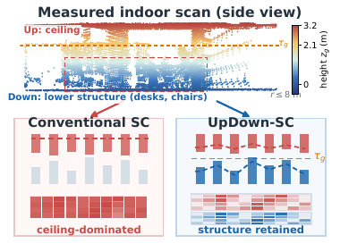
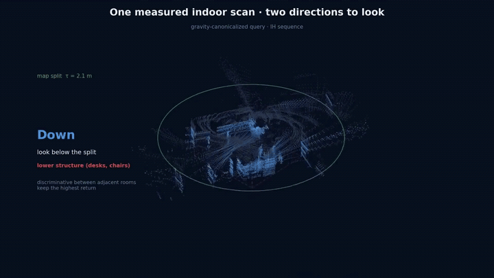
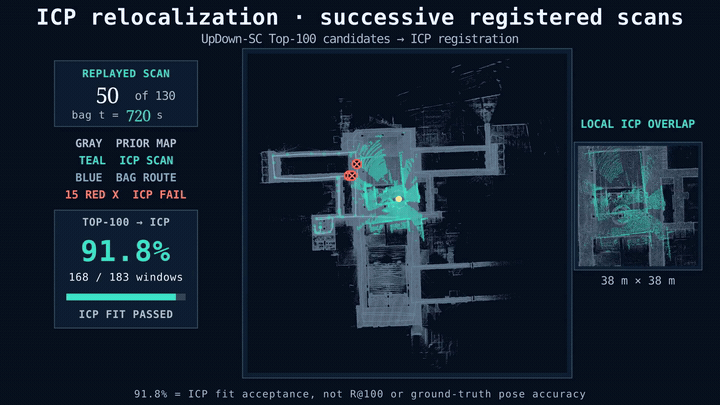

<div align="center">

# UpDown-SC

**面向室内激光雷达地点识别的重力规范化双包络 Scan Context**

Jie Xu, Yongxin Yang, Ziyi Jin, Kangjin Yu, Hongjun Huang, Chao Han, Zhongpu Xia<sup>†</sup>

**无界动力 · Anyverse Dynamics · 中国北京**

<sup>†</sup> 通讯作者：Zhongpu Xia。

<a href="https://anyverse.com/"></a>

[项目主页](https://jiejie567.github.io/updown-sc/) · [结果溯源](docs/PROVENANCE.md) · [数据说明](data/README.md)

</div>

[English](./README.md) | 中文

UpDown-SC 是一种面向室内场景、无需训练的激光雷达地点识别描述子。
传统 Scan Context 在每个极坐标网格中只保留最大高度，室内的大面积天花板
容易覆盖用于区分相邻房间和走廊的低处结构。UpDown-SC 先利用重力方向
对齐扫描，再在每个网格中分别保留低层/中层结构的上包络和高处结构的下包络。

仓库包含论文所用的独立 C++ 实现、实验协议、基线适配器、结果文件和绘图代码。

<p align="center">
  <a href="https://jiejie567.github.io/updown-sc/"></a>
</p>

## 视频演示

<p align="center"></p>
<p align="center"><em>同一帧实测扫描中，低处与顶棚结构提供互补线索。</em></p>

<p align="center"></p>
<p align="center"><em>在固定先验地图上连续进行 ICP 配准，并标出失败的尝试。</em></p>

[完整英文视频可在项目页直接播放](https://jiejie567.github.io/updown-sc/#video)。

## 快速开始

依赖：CMake 3.16+、支持 C++17 的编译器、Eigen3、PCL（`common` 和
`io`）以及 yaml-cpp。无需 ROS。

```bash
git clone https://github.com/jiejie567/updown-sc.git
cd updown-sc

cmake -S updown_sc -B build/updown-sc -DCMAKE_BUILD_TYPE=Release
cmake --build build/updown-sc -j
```

从已发布的建图会话重建描述子数据库：

```bash
build/updown-sc/scan_context_rebuild \
    <session_dir> <out.scd> gravity <runtime_params.yaml> \
    <origin_height_m> [fixed_split_m]
```

运行跨序列检索：

```bash
build/updown-sc/scan_context_cross_sequence_evaluator \
    <map.scd> <query.scd> <out.csv> \
    <shortlist_K> <w_low> <w_high> <min_joint_rings> <dist_thresh> <margin>

# 论文参数
# 100 0.3 0.7 2 0.5 0.1
```

默认描述子使用 16 个环、60 个扇区、30 m 半径和 0.25 m 体素大小。
配置见 `updown_sc/config/descriptor_params.yaml`；每个会话也附带构建时
使用的 `runtime_params.yaml`。

## 复现实验结果

精简结果包和校验和位于 `data/package/`，完整评估数据包见
[`data/README.md`](data/README.md)。

- [`docs/PROVENANCE.md`](docs/PROVENANCE.md) 记录论文数值对应的逐查询
  CSV 和实验配置。
- `experiments/common/compute_retrieval_stats.py` 重算 Wilson 区间、F1max
  和 AUPR。
- `experiments/common/compute_yaw_error.py` 重算偏航角初始估计结果。
- `experiments/common/rescore_native_baselines.py` 和
  `run_gravity_frontend_transfer.py` 重跑 Python 基线。
- `experiments/common/run_overlap_transformer.py` 和 `run_minkloc3dv2.py`
  使用官方检查点运行学习型基线。

开始复现实验前，可先运行完整发布检查：

```bash
./scripts/release_check.sh
```

该脚本会构建四个 C++ 工具，检查 Python 入口和数据归档，并重放已发布的
M2DGR 检索结果。

## 目录

| 路径 | 内容 |
|---|---|
| `updown_sc/` | 无 ROS 依赖的 C++ 描述子构建、检索和 SCD 工具 |
| `baselines/python/` | SC、SC++ (PC)、SOLiD、M2DP 和 RING++ 的 CPU 实现 |
| `baselines/adapters/` | LiDAR-Iris、BTC 和 STD 官方代码的接口 |
| `experiments/` | 数据集实验协议和学习型基线适配器 |
| `data/` | 结果包、校验和及完整数据清单 |
| `figures/` | 绘图代码和源数据 |
| `docs/` | 项目页、协议清单和结果溯源 |

官方基线仓库和学习型检查点从各自上游来源获取，本仓库不重复分发。
对应提交、检查点哈希和迁移设置见
[`docs/PROVENANCE.md`](docs/PROVENANCE.md)。

## 数据范围

发布实验以完成去畸变和运动补偿的关键帧点云为起点。数据包包含建图会话、
查询帧、位姿、重力方向、描述子参数、SCD 数据库和逐查询结果 CSV。

用于生成这些会话的 FAST-LIO2 ROS 2 前端不在本次发布范围内。描述子构建和
检索可仅使用已发布点云复现。归档中的路径字段使用 `${UPDOWN_SC_ROOT}`
占位符，详见 [`data/PATHS.md`](data/PATHS.md)。

## Python 工具

评估和绘图工具使用 Python 3.10+：

```bash
python3 -m venv .venv
source .venv/bin/activate
python -m pip install --upgrade pip
python -m pip install -r requirements.txt
```

图表和演示文稿的可选依赖列在 `requirements-figures.txt` 中。

## 部署指南

[`updown-sc-deployment/SKILL.md`](.agents/skills/updown-sc-deployment/SKILL.md)
为编码代理和自动化安装工具提供简明部署步骤；上面的命令仍是标准手动安装方式。

## 许可证

项目自行编写的代码采用 [MIT 许可证](LICENSE)。数据集、基线和媒体来源见
[`THIRD_PARTY_NOTICES.md`](THIRD_PARTY_NOTICES.md) 和
[`docs/assets/ATTRIBUTION.md`](docs/assets/ATTRIBUTION.md)。

## 引用

请参阅 [`CITATION.cff`](CITATION.cff)。已提交的预印本获得公开 arXiv
标识符后，将在此补充正式链接。
